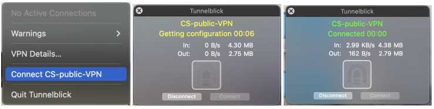
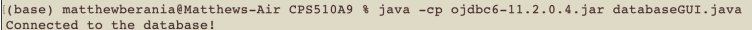
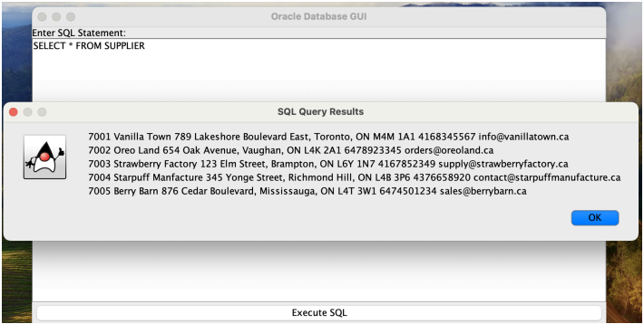
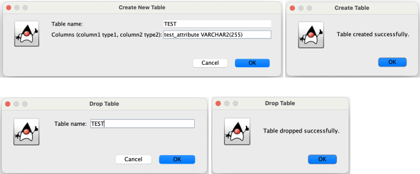
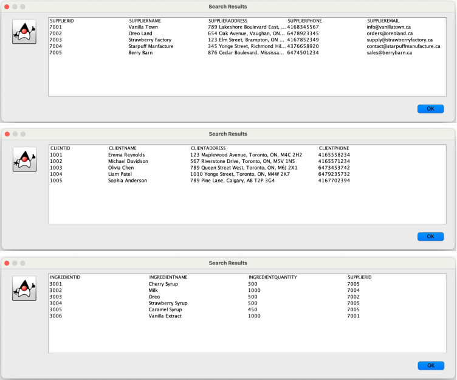
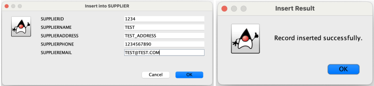
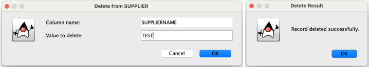
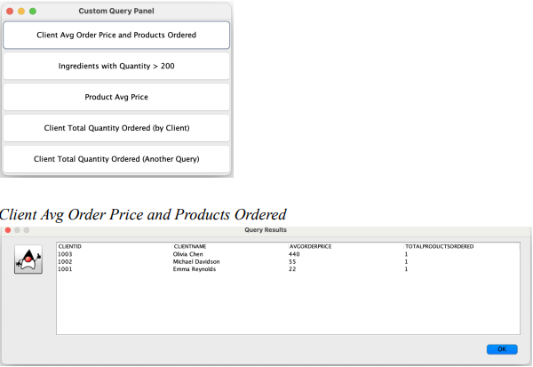

# 🍦 Ice Cream Manufacturing DBMS

A Java-based desktop GUI application for interacting with an Oracle SQL database, specifically designed for managing an ice cream manufacturing system. This tool supports dynamic table operations, custom query execution, and real-time data management.

---

## 💡 Features

- Connects to Oracle DB using JDBC
- GUI-based view, insert, and delete for all tables
- Create and drop tables with custom schema
- Execute custom SQL queries via a built-in editor
- Run predefined query reports (e.g., average order price, ingredient inventory)

---

## 🛠️ Tech Stack

- Java (JDK 8+)
- Java Swing
- Oracle JDBC (`ojdbc6-11.2.0.4.jar`)
- Oracle 11g Database (via TMU server)

---

## 🚀 How to Run

> ⚠️ Requires VPN access to TMU's CS Oracle server.

### 1. Connect to VPN

- Use **Tunnelblick** or your institution's VPN software.
- Log in with your TMU CS credentials.



---

### 2. Prepare Files

Ensure these files are in the same folder:

- `DatabaseGUI.java`
- `ojdbc6-11.2.0.4.jar`

---

### 3. Update Credentials

Open `DatabaseGUI.java` and edit the following line with your Oracle DB username and password:

```java
String dbURL = "jdbc:oracle:thin:USERNAME/PASSWORD@oracle.scs.ryerson.ca:1521:orcl";```

---

### 4. Compile & Run

Open your terminal, `cd` into the folder, and run:

```bash
java -cp ojdbc6-11.2.0.4.jar DatabaseGUI.java

```

---


## 📸 Application Screenshots

### Main GUI Window

Displays all database tables with options to view, insert, delete, create, and drop.


---

### 📝 Custom SQL Query Input & Result Display

Users can enter custom queries in the text box. Results appear in a scrollable table popup.



---

### 🧱 Create and Drop Table

Create new tables or drop existing ones using the input fields.



---

### 🔍 Table View

Example of viewing records from a selected table.



---

### 📥 Insert Into Table

Insert form is dynamically generated based on table structure.



---

### 🗑️ Delete From Table

Remove records by specifying a column and value.



---

### 📊 Custom Query Panel (Predefined Queries)

Panel for quickly running advanced SQL queries with one click.




